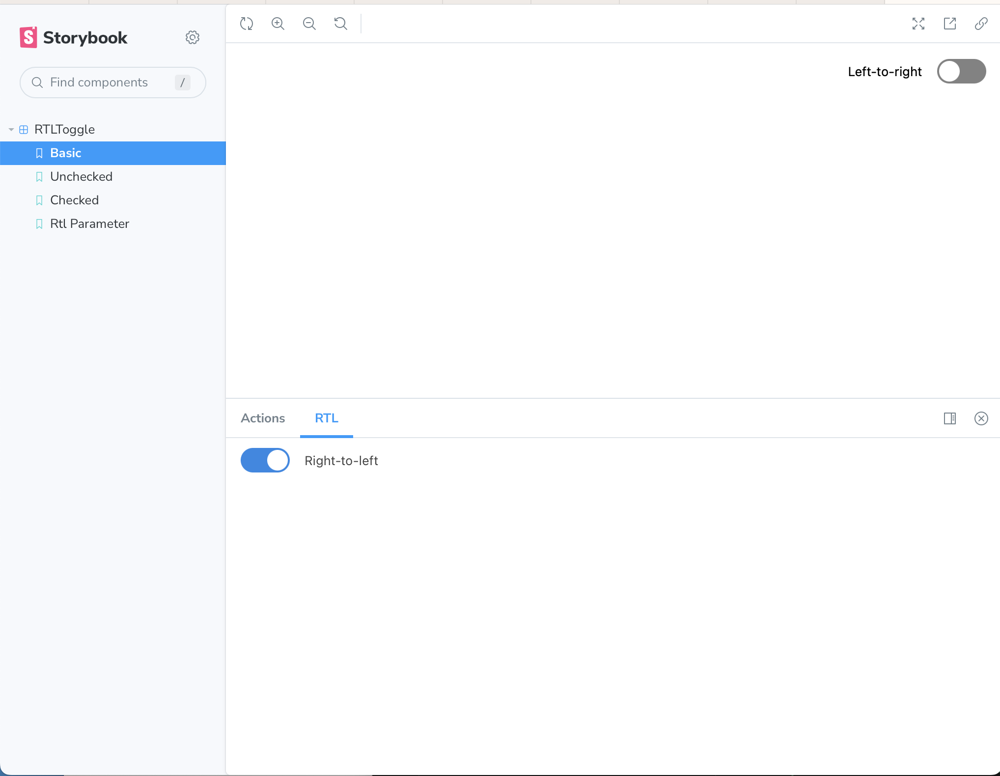

# Storybook Addon RTL [](https://www.npmjs.com/package/storybook-addon-rtl)

Storybook Addon RTL allows you to switch to right-to-left flow in your stories in [Storybook](https://storybook.js.org).

This addon has been tested with Storybook for React, Vue and Angular. It should also work in other frameworks.



> This is a permanent fork of [unindented/storybook-addon-rtl](https://github.com/unindented/storybook-addon-rtl), which is now archived. Thanks for `unindented` for the original code!

### Getting Started

```sh
npm i --save-dev storybook-addon-rtl
```

Add the addon to the addons array in `.storybook/main.js`

```js
module.exports = {
  /// other storybook configuration
  addons: [
    // other addons here
    "storybook-addon-rtl",
  ],
};
```

Add the following to `preview.js`:

```js
import { initializeRTL } from "storybook-addon-rtl";

initializeRTL();
```

Then write your stories normally:

```js
import React from 'react'
import MyComponent from './MyComponent'

export default {
  title: 'My Component',
  component: MyComponent
}
const Template = (args) => <MyComponent {...args}/>
export const default = Template.bind({})

// Optionally include direction as story parameter
rtlParameter.parameters = {
  direction: 'rtl'
}
```

## Meta

- Code: `git clone https://github.com/literalpie/storybook-addon-rtl.git`
- Home: <https://github.com/literalpie/storybook-addon-rtl/>

## Contributors

- Benjamin Kindle ([benjaminkindle@yahoo.com](mailto:benjaminkindle@yahoo.com))

## License

Copyright (c) 2023 Benjamin Kindle (@literalpie). This is free software, and may be redistributed under the terms specified in the LICENSE file.
