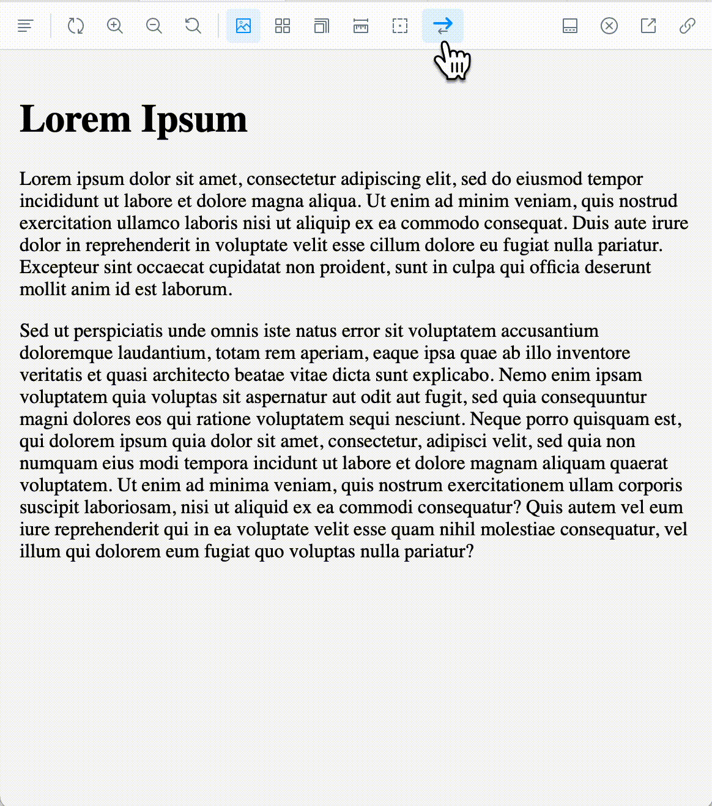

# Storybook Addon RTL [](https://www.npmjs.com/package/storybook-addon-rtl)

Storybook Addon RTL allows you to switch to right-to-left flow in your stories in [Storybook](https://storybook.js.org).

This addon has been tested with Storybook for React, Vue and Angular. It should also work in other frameworks.



> This is a permanent fork of [unindented/storybook-addon-rtl](https://github.com/unindented/storybook-addon-rtl), which is now archived. Thanks for `unindented` for the original code!

## Getting Started

```sh
npm i --save-dev storybook-addon-rtl
```

Add the addon to the addons array in `.storybook/main.js`

```js
module.exports = {
  /// other storybook configuration
  addons: [
    // other addons here
    "storybook-addon-rtl",
  ],
};
```

Then write your stories normally:

```js
import React from 'react'
import MyComponent from './MyComponent'

export default {
  title: 'My Component',
  component: MyComponent
};

export const default = {};

export const rtlParameter = {
  // Optionally include direction as story parameter
  parameters: {
    direction: 'rtl'
  }
}
```

## Advanced

### Query Params

You can set the direction using query params in the URL. This is useful for things like e2e tests.

Just add `&direction=rtl` or `&direction=ltr` to the end of the URL:

`storybook.example.com/?path=/story/button--standard&direction=rtl`

### Channel API

This addon uses the [Storybook Channel API](https://storybook.js.org/docs/addons/addons-api#usechannel) to emit and respond to direction change events. This allows anyone to write custom code that can set or react to changes in the direction. This is especially useful when working with some libraries that need to know about the current direction. See [./src/stories/CustomDecorator.stories.tsx](./src/stories/CustomDecorator.stories.tsx) for an example.

## Meta

- Code: `git clone https://github.com/literalpie/storybook-addon-rtl.git`
- Home: <https://github.com/literalpie/storybook-addon-rtl/>

## Contributors

- Benjamin Kindle ([benjaminkindle@yahoo.com](mailto:benjaminkindle@yahoo.com))

## License

Copyright (c) 2023 Benjamin Kindle (@literalpie). This is free software, and may be redistributed under the terms specified in the LICENSE file.
